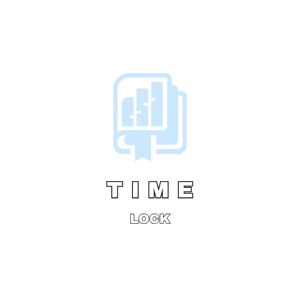

 
<h1 align="center"> 📑 TIMELOCK 📑 </h1>
 

 
 
 

    
✨ Simplify historical events | 🕰 Organize timelines efficiently | 📜 See the past in a clearer way!

---

# 📋 About
Our app makes it easier to explore and organize historical events, helping you quickly navigate through different eras, 
save time with efficient event management, and see connections between key moments in history.

# 🛠️ Installation
1. 📥 Clone the project using the "Code" button:
   git clone https://github.com/codingburgas/linked-list-sprint-project-timelock.git
 
2. 📂 Open Timelock.sIn   
3. ⚙️ Configure the project.

# 🛠️💻 Languages, Frameworks, and Tools 
## Design
 

  

## Tools for development

  
  

## Programs for documents

  
  
  

 
# 📁 Documents
<ul>
    <li><a href="./app/Documentation/TimelockDocumentation.docx">Documentation</a></li>
    <li><a href="./app/Documentation/Timelock presentation.pptx">Presentation</a></li>
    <li><a href="./app/Documentation/TimelockUnitTesting.xlsx">QA Documentation</a></li>
   </ul>

<# 👥 Team Members

| Name | Role | Grade |
| :---:   | :---: | :---: |
|  <h3>Veselina Varadeva</a></h3> | Scrum-Trainer |🟩 10V |
| <h3>Gabriela Encheva</a></h3> | Back-end Developer |🟩 10V |
| <h3>Jaklin Yankova</a></h3> | Front-end Developer |🟥 10B |
| <h3>Lachezar Gospodinov</a></h3> | QA |🟨 10A |

<h2 align="center">
 If you like the app, you can give a 🌟 to our repository!
</h2>